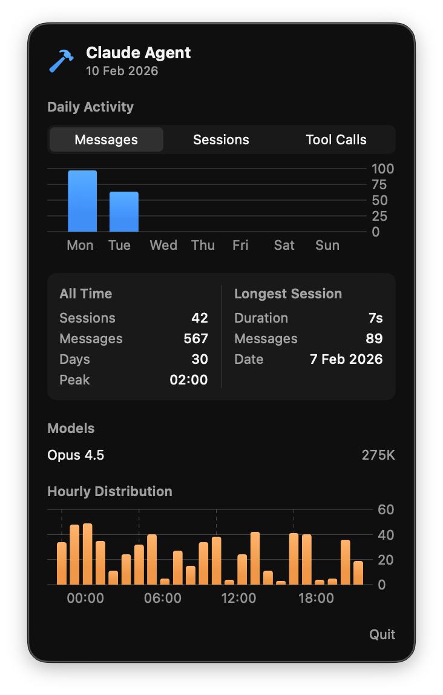

# ClaudeAgentBar

A macOS menu bar app for tracking Claude Agent stats from Xcode.

  

## Features

- Today's activity (messages, sessions, tool calls)
- Daily activity chart (last 14 days)
- All time stats with peak hour
- Best session details
- Model usage with token counts
- Hourly distribution chart
- Auto-updates when stats change

## Installation

1. Clone this repository.
2. Open in Xcode.
3. Build and run.
4. The app appears in the menu bar.

## Author

Artem Novichkov, https://artemnovichkov.com

## License

The project is available under the MIT license. See the [LICENSE](./LICENSE) file for more info.
